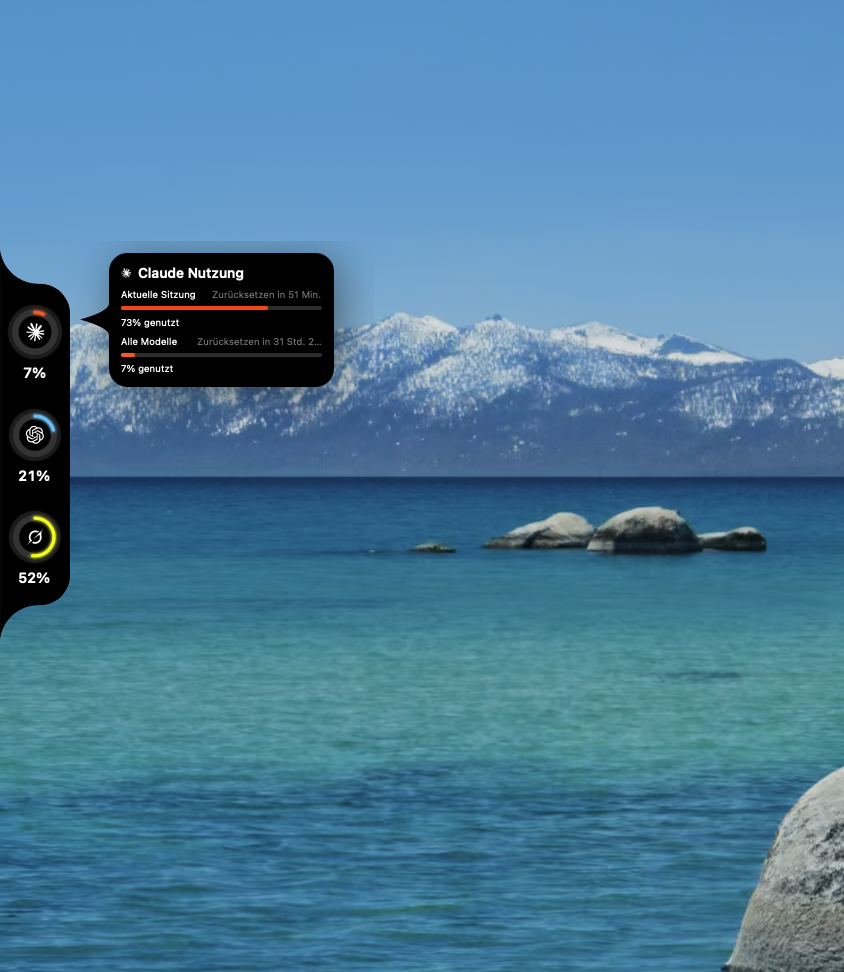

# UsageOverview

Schlanke **eigene** macOS-App (nicht Codenotch): schwarze **Usage-Notch** am **linken** Bildschirmrand für **Claude**, **Codex** und **Grok**.



| | |
|---|---|
| Platform | macOS 15+ (Xcode 16+/26+) |
| Stack | Swift / SwiftUI + AppKit `NSPanel` |
| Providers | Claude Code · Codex · Grok CLI |
| UI | Deutsch |
| License | MIT |
| Reference commit | \`cd703d9\` on \`main\` |

> **Wichtig:** Das ist **nicht** [vinzdg/codenotch](https://github.com/vinzdg/codenotch). Wenn du Codenotch klonst/installierst, sieht die Grafik anders aus (rechts, mehr Provider, anderes Logo).

## So muss es aussehen
- **Links** am Bildschirmrand (nicht rechts)
- Ruhe: dünner schwarzer Strip, **flach links / rund rechts**
- Hover: drei Ringe — Claude (Wochenlimit), Codex (**hellblau**), Grok (**Favicon-Swirl**, kein X)
- Tooltip auf Deutsch mit Balken + Reset

Wenn das nicht passt, bist du auf dem falschen Repo/Branch oder einem alten Stand.

## Install (anderer Mac) — genau dieser Stand

```bash
# 1) Nur DIESES Repo, Branch main
git clone https://github.com/Amoxidx/Usage_overview_AI.git
cd Usage_overview_AI
git checkout main
git pull
git rev-parse --short HEAD   # sollte >= cd703d9 sein

# 2) Xcode-Toolchain (nicht nur CLT)
export DEVELOPER_DIR=/Applications/Xcode.app/Contents/Developer
brew install xcodegen

# 3) Bauen + starten
make run
# oder dauerhaft über LaunchServices:
./launch-usageoverview.sh
```

Die App erscheint **ohne Dock-Icon** (Menüleiste: halbgefüllter Kreis). Linken Rand mittlere Höhe anfahren.

### Demo / QA
```bash
make demo          # Beispieldaten
make qa            # Demo + expandiert (für Screenshots)
```

## Features
- Hover-Expand / Zuklappen (Maus-Polling)
- **Claude-Ring = Wochenlimit**; Sitzung nur im Tooltip
- Codex hellblau; Grok = grok.com-Favicon
- Keine Session-Busy-UI, keine Sounds, kein Sparkle

## Live data
| Provider | Source |
|----------|--------|
| Claude | `claude /usage` |
| Codex | `~/.codex/auth.json` → ChatGPT usage API |
| Grok | `~/.grok/auth.json` → billing credits |

Credentials **read-only**. Abgelaufenes Grok → `grok login` im Terminal.

## Agent notes
Siehe [AGENTS.md](./AGENTS.md) und [docs/ARCHITECTURE.md](./docs/ARCHITECTURE.md).

## Credit
Design-Ideen angelehnt an [vinzdg/codenotch](https://github.com/vinzdg/codenotch) (MIT). **Kein Fork** — eigener Code.
